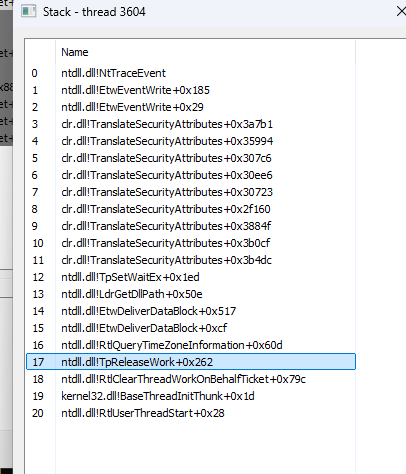

Executing .NET Files from an Unmanaged Process with Manual CLR Loading.

Manually loading the CLR in an unmanaged process and using hardware breakpoints can reveal when the CLR calls ```NtTraceEvent``` through the managed thread pool.

To evade detection, this tool offers two approaches:

- Fileless execution by hooking ```NtTraceEvent``` ```AmsiScan``` and thread-pooling functions using hardware breakpoints.
- Patching the target function via an APC (Asynchronous Procedure Call).

The CLR utilizes thread pooling to optimize the execution of .NET applications. Some calls to ```NtTraceEvent``` are made via the thread pool. 
To evade these calls, it is necessary to either control the thread pool or patch the function's implementation.



It is also very important to hook ```NtCreateThreadEx``` because some assemblies, such as SharpUp, use multithreading. New threads created by these assemblies can generate telemetry via ```NtTraceEvent```.

https://github.com/GhostPack/SharpUp/blob/master/SharpUp/Program.cs#L53

# Fileless method

Set Hardware Breakpoints (HWBP) on the Following Functions:

 - ```AmsiScanBuffer``` : Redirect the instruction pointer (rip) to the return instruction, and set the rax register to AMSI_RESULT_CLEAN.
- ```NtTraceEvent``` : Redirect rip to the return instruction, and set the rax register to STATUS_SUCCESS.
- ```NtCreateThreadEx``` : When the assembly creates a thread, the hook intercepts the function call and runs it via an indirect syscall. Once the thread is created, the HWBP is placed on the new thread, and rip is redirected to the return instruction.
- ```NtCreateWorkerFactory``` : Modify the start address of the worker factory to a controlled function to place an HWBP on threads created by the worker factory. After setting the HWBP, jump back to the legitimate start address.
- ```RtlQueueWorkItem``` : Modify the start address of the thread pool to a controlled function to place an HWBP on threads created by the worker factory. After setting the HWBP, jump back to the legitimate start address.

Warning: 
Be aware that ```NtTraceEvent``` is sometimes called outside controlled threads due to the limitation of HWBP (only 4 addresses can be set). During long assembly executions (e.g., running Seatbelt with -group=all), you may encounter 1 or 2 uncontrolled events.

| NtTraceEvent Leak            | Nbr of Call |
|------------------------------|-------------|
| Seatbelt -group=all          | +/- 2       |
| Seatbelt -group=misc         | 1           |
| SharpUp audit                | 0           |
| Rubeus triage                | 0           |

NB : If you're daring, you could parse all threads in the process for each HWBP hit to check whether the HWBP is present, reducing the risk of ```NtTraceEvent``` leaks. However, I did not implement this method because I believe making numerous calls to ```CreateToolhelpSnapshot```/```OpenProcess``` is riskier than allowing a few ```NtTraceEvent``` leaks.

Another possibility is to add a watchdog that checks every X ms if a new thread is present, and then adds an HWBP to it.

Some assemblies may encounter issues with HWBP hooking (but not with patching) for unknown reasons.

# Patching method

Use WriteProcessMemoryAPC to patch the content AmsiScanBuffer and NtTraceEvent with : 

```
nop
xor rax, rax
ret
```

# Opsec consideration

- Consideration 1 :
Evading ETW is effective, but you might observe strange behavior during execution. If your process loads the CLR and ETW does not receive telemetry, this is not a normal aspect of assembly execution.

- Consideration 2 :
Loading the CLR from a managed process can appear suspicious. You can inject your assembly into a process where the CLR is already loaded.

- Consideration 3 :
Patching a function is the most reliable way (100% certain) to ensure it will not be called, but it is also the most dangerous method for evading AMSI/ETW.

- Consideration 4 :
Evading AMSI and ETW is not a silver bullet. If your assembly exhibits malicious behavior or is subject to a memory scan, an AV/EDR can still catch you !

- Consideration 5 :
Having ETW blind at 100% is not a legitimate action; take this into consideration.


# Important notes

Development & Testing on Windows 11 Pro 23H2 x64; I haven't checked or tested on other systems.

It doesn't work on x86 systems due to the indirect syscall on the ```NtCreateThreadEx``` hook.

On Windows 10, more ```NtTraceEvent``` leaks are present, probably due to a different method for thread pooling. However, don't forget that having ETW blind at 100% is not legitimate. It's better to spend 15 minutes editing the assembly to remove IoCs and keep ETW active.

Keep in mind, it's more of a proof of concept (POC) than a ready-to-use tool.

# Credit

- WriteProcessMemoryAPC : https://www.x86matthew.com/view_post?id=writeprocessmemory_apc
- InlineExecute-Assembly : https://github.com/anthemtotheego/InlineExecute-Assembly
- ExecuteAssembly : https://github.com/med0x2e/ExecuteAssembly
- HWBP : https://www.intel.com/content/dam/support/us/en/documents/processors/pentium4/sb/253669.pdf (chapter 18)
- TartarusGate : https://github.com/trickster0/TartarusGate
